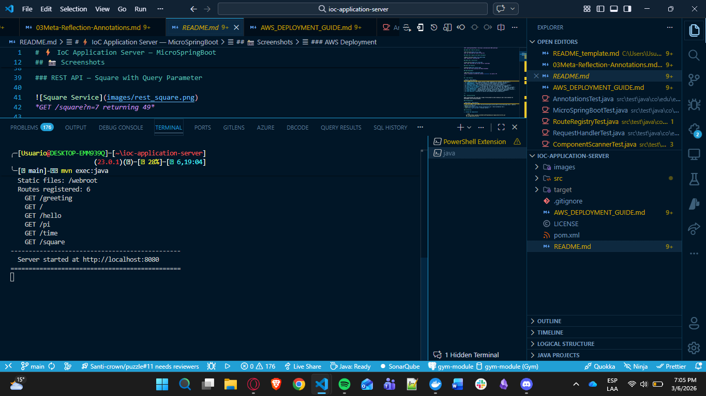
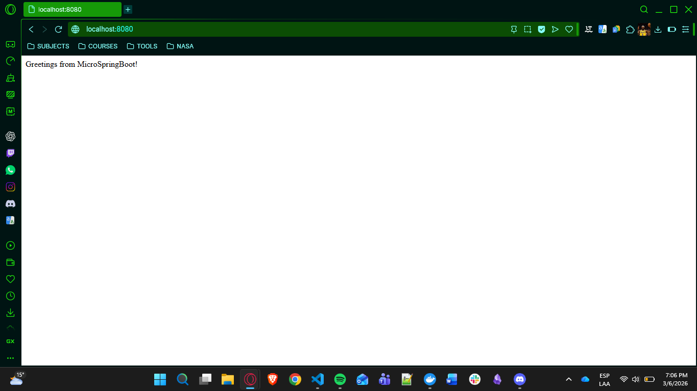
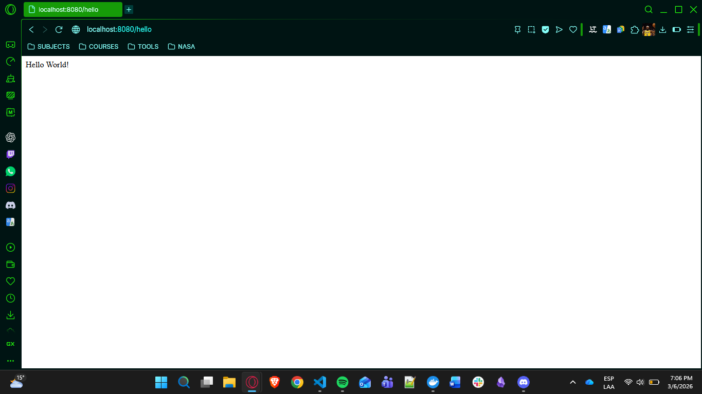
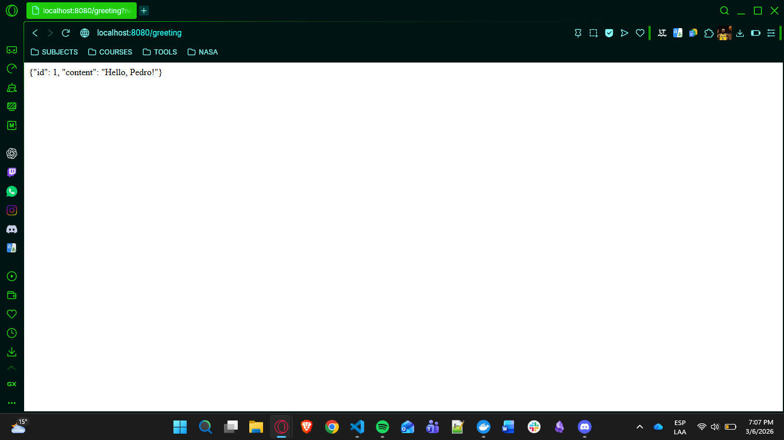
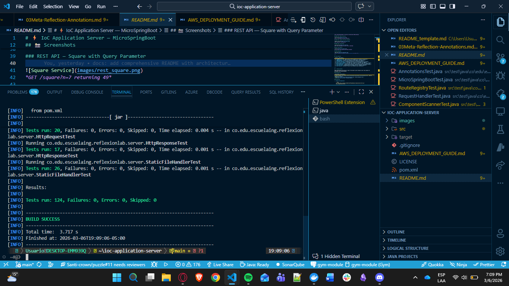
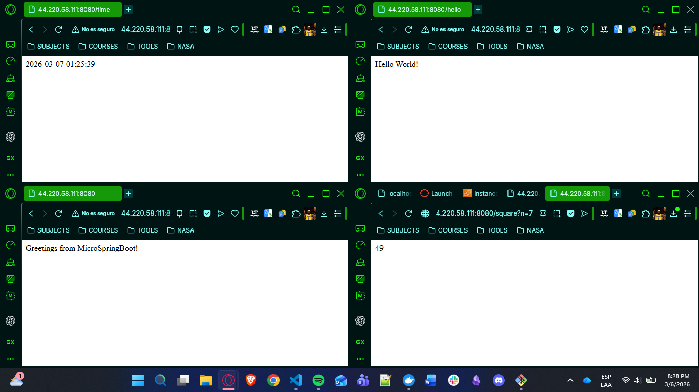

# ⚡ IoC Application Server — MicroSpringBoot

> A lightweight **Java web server** with a built-in **IoC framework** that leverages **reflection**, **custom annotations**, and **meta-object protocols** to discover and load REST controllers automatically — all powered by raw Java sockets with **zero external dependencies**.


---

## 📸 Screenshots

### Server Startup


*MicroSpringBoot starting with auto-discovered routes and configuration banner*

### Static File Serving (index.html)


*Dark-themed API Explorer served from the `/webroot` static files directory*

### REST API — Hello Service


*GET /hello returning "Hello World!"*

### REST API — Greeting with @RequestParam


*GET /greeting?name=Pedro returning a personalized JSON greeting*

### REST API — Math PI Service


*GET /pi returning the value of Math.PI*

### REST API — Square with Query Parameter


*GET /square?n=7 returning 49*

### REST API — Time Server


*GET /time returning the current server timestamp*

### Unit Test Results


*All 124 unit tests passing with BUILD SUCCESS*

### AWS Deployment


*Server running on an AWS EC2 instance accessible via public IP*

---

## ✨ Key Features

| Feature | Description |
|---------|-------------|
| 🏷️ **@RestController** | Marks classes as REST components for automatic IoC discovery |
| 🔗 **@GetMapping** | Maps HTTP GET requests to handler methods with path binding |
| 🔍 **@RequestParam** | Extracts query parameters with default value support |
| 📡 **Classpath Scanning** | Automatically discovers all annotated controllers at startup |
| 🔧 **CLI Controller Loading** | Load specific controllers via command-line arguments |
| 📁 **Static File Serving** | Serves HTML, CSS, JS, PNG, JPG, GIF, SVG, ICO, JSON from classpath |
| ⚡ **Zero Dependencies** | Built with pure Java sockets — no Spring, no Jetty, no external libs |
| 🪞 **Java Reflection** | Runtime method invocation, annotation processing, meta-object protocol |
| 🧪 **124 Unit Tests** | Comprehensive test coverage across all framework components |
| 🧩 **IoC Pattern** | Inversion of Control with automatic bean instantiation |

---

## 🚀 Getting Started

These instructions will give you a copy of the project up and running on your local machine for development and testing purposes.

### Prerequisites

| Requirement | Description |
|-------------|-------------|
| [Java 17+](https://www.oracle.com/java/technologies/javase/jdk17-archive-downloads.html) | JDK for compiling and running |
| [Maven 3.9+](https://maven.apache.org/download.cgi) | Build automation tool |
| [Git](https://git-scm.com/) | Version control |

### Installing

1. **Clone the repository**

    ```bash
    git clone https://github.com/AnderssonProgramming/ioc-application-server.git
    cd ioc-application-server
    ```

2. **Build the project**

    ```bash
    mvn clean compile
    ```

3. **Run the tests**

    ```bash
    mvn test
    ```

4. **Start the server (auto-scan mode)**

    ```bash
    mvn exec:java
    ```

5. **Start the server (CLI mode — specific controller)**

    ```bash
    java -cp target/classes co.edu.escuelaing.reflexionlab.MicroSpringBoot co.edu.escuelaing.reflexionlab.demo.HelloController
    ```

6. **Open your browser and test**

    | URL | Description |
    |-----|-------------|
    | [http://localhost:8080/](http://localhost:8080/) | Static web page (API Explorer) |
    | [http://localhost:8080/hello](http://localhost:8080/hello) | Hello World greeting |
    | [http://localhost:8080/greeting?name=Pedro](http://localhost:8080/greeting?name=Pedro) | Personalized greeting with @RequestParam |
    | [http://localhost:8080/pi](http://localhost:8080/pi) | Value of Math.PI |
    | [http://localhost:8080/square?n=7](http://localhost:8080/square?n=7) | Square of a number |
    | [http://localhost:8080/time](http://localhost:8080/time) | Current server time |

---

## 📖 Introduction and Motivation

This project builds a **web application server** (similar to Apache) in Java, enhanced with an **IoC (Inversion of Control) framework** that uses **Java reflection** and **custom annotations** to automatically discover and load REST controllers. The architecture is inspired by Spring Boot, demonstrating how frameworks leverage meta-object protocols for enterprise application development.

### What is IoC (Inversion of Control)?

IoC is a design pattern where the flow of a program is inverted — instead of the programmer controlling the flow, a **framework** takes control:

```
📝 Annotated POJO → 🔍 Component Scanner → 🪞 Reflection → 🔀 Route Registry → ⚡ Request Handler
```

1. **Component Scanning** — The framework scans the classpath for `@RestController` classes
2. **Reflection** — Discovers `@GetMapping` methods and `@RequestParam` parameters at runtime
3. **Bean Instantiation** — Creates controller instances (POJOs) automatically
4. **Route Registration** — Maps URI paths to handler methods
5. **Request Handling** — Resolves parameters and invokes methods via reflection

### How Annotations Power the Framework

```
@RestController          → "I am a component, discover me!"
    @GetMapping("/path") → "Map GET /path to this method"
        @RequestParam    → "Bind this query parameter to my argument"
```

### Why This Approach?

| Component | Technology | Why? |
|-----------|------------|------|
| **Language** | Java 17 | Modern features, lambda support, reflection API |
| **Networking** | Raw Sockets (java.net) | Deep understanding of HTTP protocol |
| **IoC** | Custom Annotations + Reflection | Demonstrates meta-object protocol concepts |
| **Build** | Maven | Industry-standard Java build tool |
| **Testing** | JUnit 4 | Reliable, widely-adopted test framework |
| **Dependencies** | None (runtime) | Minimal footprint, educational value |

### Learning Objectives

By studying this project, you will understand:

1. ✅ How to create custom annotations (`@RestController`, `@GetMapping`, `@RequestParam`)
2. ✅ How Java reflection works (meta-object protocol, runtime introspection)
3. ✅ How IoC containers discover and instantiate beans (classpath scanning)
4. ✅ How HTTP protocol works at the socket level
5. ✅ How to parse HTTP requests (method, URI, query parameters, headers)
6. ✅ How to implement a routing system with reflection-based dispatch
7. ✅ How to serve static files with proper MIME type detection
8. ✅ The architecture and design of web frameworks like Spring Boot

---

## 🏗️ Architecture

```
┌─────────────────────────────────────────────────────────┐
│                  HTTP Client (Browser)                   │
└─────────────────────┬───────────────────────────────────┘
                      │ HTTP Request
                      ▼
┌─────────────────────────────────────────────────────────┐
│          MicroSpringBoot (Socket Listener)               │
│           Listens on port 8080 for connections           │
└─────────────────────┬───────────────────────────────────┘
                      │
         ┌────────────┴────────────┐
         │  Startup: IoC Container │
         │                         │
         │  1. ComponentScanner    │
         │     scans classpath     │
         │  2. Finds @RestController│
         │  3. Instantiates POJOs  │
         │  4. Registers @GetMapping│
         │     routes via Reflection│
         └────────────┬────────────┘
                      │ Parse Request
                      ▼
┌─────────────────────────────────────────────────────────┐
│              HttpRequest Parser                          │
│    Extracts: method, path, query params, headers         │
└─────────────────────┬───────────────────────────────────┘
                      │ Route Decision
                      ▼
          ┌───────────┴───────────┐
          ▼                       ▼
┌──────────────────┐   ┌──────────────────────┐
│  REST Route      │   │  Static File Request │
│  (RouteRegistry) │   │  (*.html, *.css, ...) │
│                  │   │                      │
│  RequestHandler  │   │  StaticFileHandler   │
│  resolves params │   │  reads from classpath│
│  invokes method  │   │  /webroot directory  │
│  via Reflection  │   │                      │
└────────┬─────────┘   └──────────┬───────────┘
         │                        │
         ▼                        ▼
┌──────────────────┐   ┌──────────────────────┐
│  @GetMapping     │   │  File Bytes +        │
│  Method invoked  │   │  MIME Content-Type   │
│  @RequestParam   │   │  Detection           │
│  resolved        │   │                      │
└────────┬─────────┘   └──────────┬───────────┘
         │                        │
         └────────────┬───────────┘
                      ▼
┌─────────────────────────────────────────────────────────┐
│              HttpResponse Builder                        │
│    Status line + Headers + Body → Output Stream          │
└─────────────────────────────────────────────────────────┘
```

### Request Flow

1. **Client** sends an HTTP request to `localhost:8080`
2. **MicroSpringBoot** accepts the socket connection and reads the raw HTTP request
3. **HttpRequest Parser** extracts the method, URI, query string, and headers
4. **Router** decides:
   - If path matches a registered `@GetMapping` route → delegate to **RequestHandler**
   - Otherwise → delegate to **StaticFileHandler** (static files)
5. **RequestHandler** resolves `@RequestParam` annotations and invokes the method via reflection
6. **HttpResponse Builder** sends proper HTTP response with headers back to client

### IoC Container Flow

```
          ┌─────────────────────┐
          │    Application      │
          │      Startup        │
          └──────────┬──────────┘
                     │
          ┌──────────▼──────────┐
          │  ComponentScanner   │
          │  scan("package")    │
          └──────────┬──────────┘
                     │ finds .class files
          ┌──────────▼──────────┐
          │  Check: has         │
          │  @RestController?   │
          └──────────┬──────────┘
                     │ yes
          ┌──────────▼──────────┐
          │  Instantiate POJO   │
          │  (newInstance())    │
          └──────────┬──────────┘
                     │
          ┌──────────▼──────────┐
          │  Scan methods for   │
          │  @GetMapping        │
          └──────────┬──────────┘
                     │
          ┌──────────▼──────────┐
          │  Register route in  │
          │  RouteRegistry      │
          └─────────────────────┘
```

---

## 📁 Repository Structure

```
ioc-application-server/
├── 📄 README.md                                         # Project documentation
├── 📄 AWS_DEPLOYMENT_GUIDE.md                           # Step-by-step AWS deployment guide
├── 📄 LICENSE                                           # MIT License
├── 📄 pom.xml                                           # Maven build configuration
├── 📄 .gitignore                                        # Git ignore rules
├── 📁 images/                                           # Screenshots for README
├── 📁 src/
│   ├── 📁 main/
│   │   ├── 📁 java/co/edu/escuelaing/reflexionlab/
│   │   │   ├── 🔷 MicroSpringBoot.java                 # Main server: IoC container + HTTP server
│   │   │   ├── 📁 annotations/
│   │   │   │   ├── 🏷️ RestController.java              # @RestController — component marker
│   │   │   │   ├── 🏷️ GetMapping.java                  # @GetMapping — route binding
│   │   │   │   └── 🏷️ RequestParam.java                # @RequestParam — query parameter binding
│   │   │   ├── 📁 server/
│   │   │   │   ├── 🔷 HttpRequest.java                  # HTTP request parser
│   │   │   │   ├── 🔷 HttpResponse.java                 # HTTP response builder (fluent API)
│   │   │   │   └── 🔷 StaticFileHandler.java            # Static file serving + MIME detection
│   │   │   ├── 📁 ioc/
│   │   │   │   ├── 🔷 ComponentScanner.java             # Classpath scanner for @RestController
│   │   │   │   ├── 🔷 RouteRegistry.java                # Route storage and lookup
│   │   │   │   └── 🔷 RequestHandler.java               # Reflection-based method invoker
│   │   │   └── 📁 demo/
│   │   │       ├── 🔷 HelloController.java              # GET / and /hello
│   │   │       ├── 🔷 GreetingController.java           # GET /greeting with @RequestParam
│   │   │       └── 🔷 MathController.java               # GET /pi, /square, /time
│   │   └── 📁 resources/
│   │       └── 📁 webroot/                               # Static web files
│   │           ├── 📄 index.html                         # API Explorer page
│   │           ├── 📄 style.css                          # Dark theme stylesheet
│   │           └── 📄 app.js                             # Client-side API caller
│   └── 📁 test/
│       └── 📁 java/co/edu/escuelaing/reflexionlab/
│           ├── 🧪 MicroSpringBootTest.java               # 13 integration tests
│           ├── 📁 annotations/
│           │   └── 🧪 AnnotationsTest.java               # 15 annotation contract tests
│           ├── 📁 ioc/
│           │   ├── 🧪 ComponentScannerTest.java          # 10 classpath scanning tests
│           │   ├── 🧪 RequestHandlerTest.java            # 9 reflection invocation tests
│           │   └── 🧪 RouteRegistryTest.java             # 14 route management tests
│           └── 📁 server/
│               ├── 🧪 HttpRequestTest.java               # 20 request parsing tests
│               ├── 🧪 HttpResponseTest.java              # 17 response building tests
│               └── 🧪 StaticFileHandlerTest.java         # 26 static file tests
```

---

## 🔧 Components

### 1. Custom Annotations — The Meta-Object Protocol

#### @RestController

Marks a class as a REST component for automatic IoC discovery:

```java
@Retention(RetentionPolicy.RUNTIME)
@Target(ElementType.TYPE)
public @interface RestController { }
```

#### @GetMapping

Maps HTTP GET requests to handler methods:

```java
@Retention(RetentionPolicy.RUNTIME)
@Target(ElementType.METHOD)
public @interface GetMapping {
    String value();
}
```

#### @RequestParam

Binds query parameters to method arguments with default value support:

```java
@Retention(RetentionPolicy.RUNTIME)
@Target(ElementType.PARAMETER)
public @interface RequestParam {
    String value();
    String defaultValue() default "";
}
```

### 2. ComponentScanner — Classpath Discovery

Scans the classpath for `@RestController` annotated classes using Java reflection:

```java
ComponentScanner scanner = new ComponentScanner();
List<Class<?>> controllers = scanner.scan("co.edu.escuelaing.reflexionlab.demo");
// Finds: HelloController, GreetingController, MathController
```

### 3. RequestHandler — Reflection-Based Invocation

Resolves `@RequestParam` annotations and invokes controller methods via reflection:

```java
// Incoming request: GET /greeting?name=Pedro
// → Resolves @RequestParam(value="name", defaultValue="World")
// → Invokes: greetingController.greeting("Pedro")
// → Returns: {"id": 1, "content": "Hello, Pedro!"}
```

### 4. HttpRequest — Request Parser

Parses raw HTTP requests into structured objects:

```java
HttpRequest req = new HttpRequest("GET /greeting?name=Pedro HTTP/1.1\r\n...");
req.getMethod();            // "GET"
req.getPath();              // "/greeting"
req.getQueryParam("name");  // "Pedro"
```

### 5. StaticFileHandler — Static File Server

Serves files from the classpath with automatic MIME type detection:

| Extension | MIME Type |
|-----------|-----------|
| `.html`, `.htm` | `text/html` |
| `.css` | `text/css` |
| `.js` | `application/javascript` |
| `.json` | `application/json` |
| `.png` | `image/png` |
| `.jpg`, `.jpeg` | `image/jpeg` |
| `.gif` | `image/gif` |
| `.svg` | `image/svg+xml` |
| `.ico` | `image/x-icon` |

### 6. MicroSpringBoot — The Framework Core

The main server class providing two modes of operation:

```java
// Mode 1: Auto-scan (discovers all @RestController classes)
MicroSpringBoot server = new MicroSpringBoot();
server.scanComponents("co.edu.escuelaing.reflexionlab");
server.start();

// Mode 2: CLI (load specific controller)
// java -cp target/classes co.edu.escuelaing.reflexionlab.MicroSpringBoot \
//   co.edu.escuelaing.reflexionlab.demo.HelloController
```

---

## 💡 Example: How Developers Use the Framework

### Creating a Controller

```java
@RestController
public class GreetingController {

    private static final String template = "Hello, %s!";
    private final AtomicLong counter = new AtomicLong();

    @GetMapping("/greeting")
    public String greeting(@RequestParam(value = "name", defaultValue = "World") String name) {
        return String.format("{\"id\": %d, \"content\": \"%s\"}",
                counter.incrementAndGet(), String.format(template, name));
    }
}
```

### Available URLs After Starting

| URL | Response |
|-----|----------|
| `http://localhost:8080/` | Static API Explorer page |
| `http://localhost:8080/hello` | `Hello World!` |
| `http://localhost:8080/greeting?name=Pedro` | `{"id": 1, "content": "Hello, Pedro!"}` |
| `http://localhost:8080/pi` | `3.141592653589793` |
| `http://localhost:8080/square?n=7` | `49` |
| `http://localhost:8080/time` | `2026-03-05 10:30:00` |

---

## 🧪 Tests

The project includes **124 unit tests** covering all framework components:

| Test Class | Tests | Coverage Areas |
|------------|-------|----------------|
| `HttpRequestTest` | 20 | Query params, URL decoding, headers, immutability |
| `HttpResponseTest` | 17 | Status codes, fluent API, build output, headers |
| `StaticFileHandlerTest` | 26 | MIME types, file detection, path handling |
| `RouteRegistryTest` | 14 | Route CRUD, path normalization, immutability |
| `RequestHandlerTest` | 9 | Route dispatch, @RequestParam resolution, defaults |
| `ComponentScannerTest` | 10 | Classpath scanning, controller loading, validation |
| `AnnotationsTest` | 15 | Retention policies, targets, annotation contracts |
| `MicroSpringBootTest` | 13 | Integration tests, endpoints, scanning, static files |

### Running Tests

```bash
mvn test
```

Expected output:

```
[INFO] Tests run: 124, Failures: 0, Errors: 0, Skipped: 0
[INFO] BUILD SUCCESS
```

---

## ☁️ AWS Deployment

This server has been deployed on AWS EC2. For a complete step-by-step guide, see:

📄 **[AWS_DEPLOYMENT_GUIDE.md](AWS_DEPLOYMENT_GUIDE.md)**

Quick summary:
1. Launch an EC2 instance (Amazon Linux 2023 / Ubuntu)
2. Install Java 17 and Maven
3. Clone the repository and build
4. Run the server on the EC2 instance
5. Configure Security Group to allow inbound traffic on port 8080

---

## 🛠️ Built With

| Technology | Purpose |
|------------|---------|
| [Java 17](https://www.oracle.com/java/technologies/javase/jdk17-archive-downloads.html) | Programming language with reflection and lambda support |
| [Maven](https://maven.apache.org/) | Build automation and dependency management |
| [JUnit 4](https://junit.org/junit4/) | Unit testing framework |
| [Java Sockets](https://docs.oracle.com/javase/tutorial/networking/sockets/) | Raw TCP networking for HTTP server |
| [Java Reflection API](https://docs.oracle.com/javase/tutorial/reflect/) | Runtime introspection and method invocation |
| [AWS EC2](https://aws.amazon.com/ec2/) | Cloud deployment |

---

## 📚 Concepts Demonstrated

### Meta-Object Protocol (MOP)
The framework uses Java's reflection API as a **meta-object protocol**, providing programmatic access to language constructs (classes, methods, parameters, annotations) at runtime.

### Inversion of Control (IoC)
The framework follows the **Hollywood Principle** — "Don't call us, we'll call you." Developers define POJOs with annotations, and the framework takes control of:
- Component discovery (`@RestController`)
- Route registration (`@GetMapping`)
- Parameter binding (`@RequestParam`)
- Method invocation (via reflection)

### Reflection
Java reflection enables the framework to:
- Scan the classpath for annotated classes
- Instantiate controller objects dynamically
- Discover and invoke handler methods at runtime
- Resolve method parameter annotations for query binding

---

## 👤 Author

**Andersson David Sánchez Méndez**

[](https://github.com/AnderssonProgramming)

---

## 📄 License

This project is licensed under the MIT License - see the [LICENSE](LICENSE) file for details.

---

## 🙏 Acknowledgments

- **Luis Daniel Benavides Navarro** — Professor, course on Application Server Architectures, Meta-Object Protocols, IoC Pattern, and Reflection
- **Escuela Colombiana de Ingeniería Julio Garavito** — AREP Course
- Java documentation team — Comprehensive reflection and networking tutorials
- Spring Boot — Inspiration for the annotation-based controller architecture